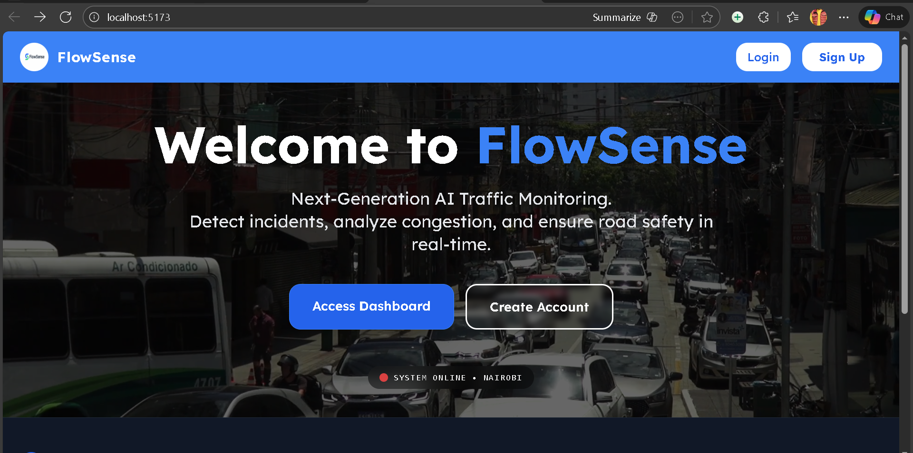
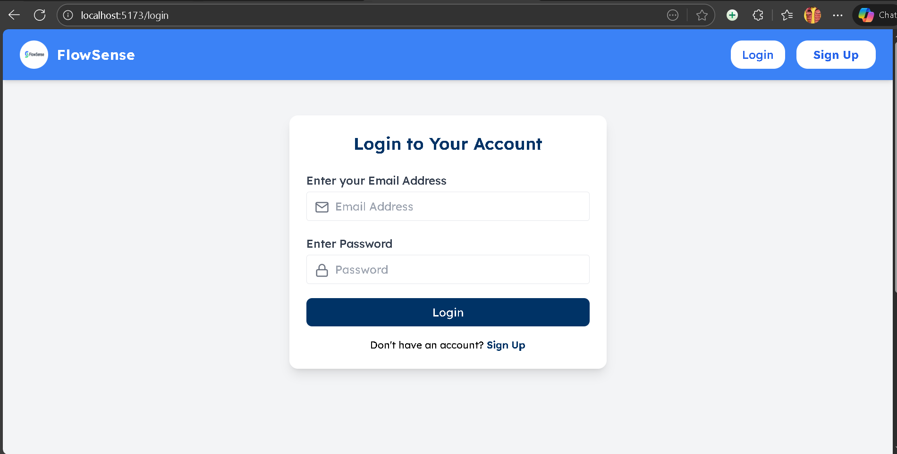
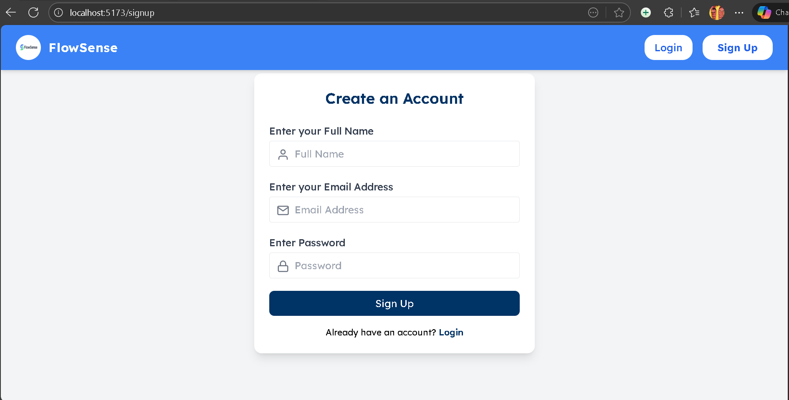
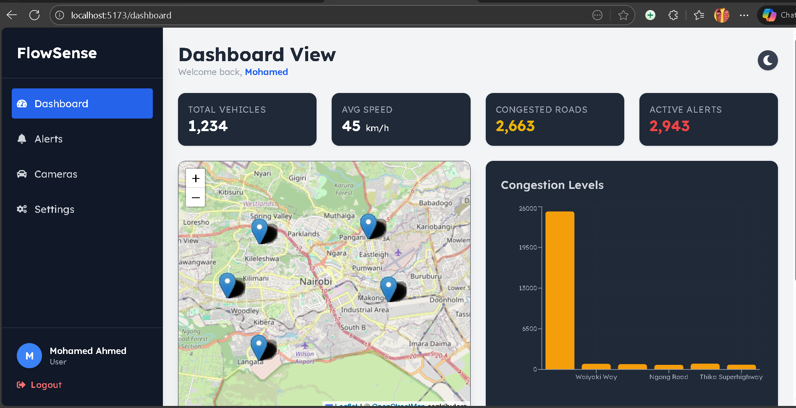

# 🚦 FlowSense: Smart Traffic Monitoring System

An intelligent, full-stack web platform designed to monitor traffic conditions, detect incidents using Computer Vision, and provide real-time analytics for urban environments (specifically Nairobi).

## 📸 System Preview






## 🚀 Key Features
- **AI Computer Vision:** Uses YOLOv8 and OpenCV to count vehicles and detect high-density congestion in real-time.
- **Real-Time Dashboard:** Visualizes traffic flow, congestion levels, and drops pins on an interactive Leaflet map.
- **Instant Alerts:** WebSockets (Socket.io) push notifications to the screen instantly with audio cues.
- **SMS Notifications:** Integrates Africa's Talking API to dispatch emergency SMS alerts to traffic officers.
- **Role-Based Access Control:** Secure JWT authentication separating System Admins from Traffic Controllers.
- **Automated Reporting:** Generate and download PDF incident reports instantly.

## 🛠️ Tech Stack
- **Frontend:** React.js, Tailwind CSS, Recharts, React-Leaflet
- **Backend:** Node.js, Express.js, Socket.io
- **Database:** MongoDB Atlas (Cloud)
- **AI Engine:** Python, YOLOv8, OpenCV
- **External APIs:** Africa's Talking (SMS)

## 📦 How to Run Locally

```bash
### 1.Backend Setup
cd Backend
npm install
npm run dev

### 2.Frontend Setup

cd Frontend
npm install
npm run dev

###AI Engine Setup

cd AI_Engine
pip install ultralytics opencv-python requests
python real_ai_monitor.py